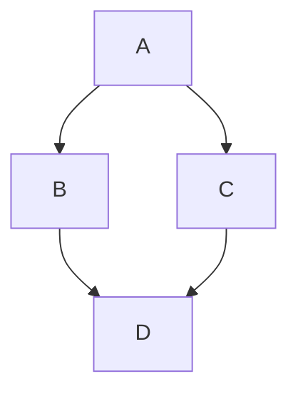
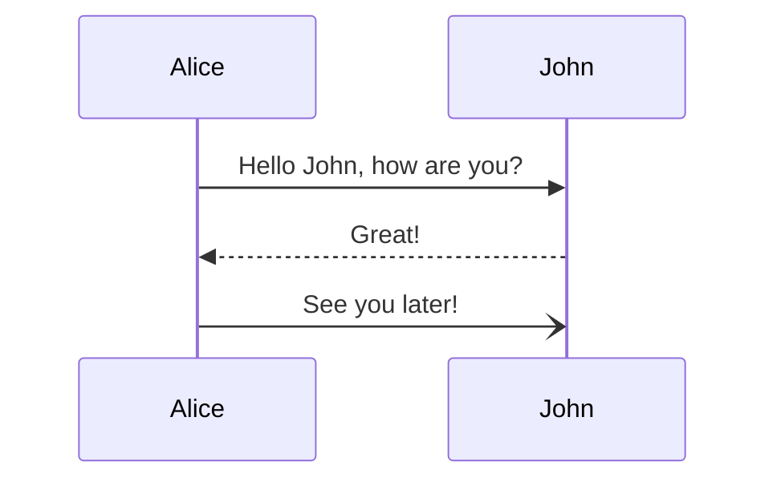

##### System Design

#### News feed

Task : Design a news feed app, Design a news feed that provides a user with a list of news items, sorted by approximate reverse chronological order that belong to the topics selected by the user. A news item can be categorized into 1–3 topics. A user may select up to three topics of interest at any time.

##### functional requirements

1. A user can select topics of interest. There are up to 100 tags. 

2. A user can fetch a list of English-language news items 10 at a time, up to 1,000 items.

3. Although a user need only fetch up to 1,000 items, our system should archive all items.

4. Let’s first allow users to get the same items regardless of their geographical location and then consider personalization, based on factors like location and language.

5. Latest news first; that is, news items should be arranged in reverse chronological order, but this can be an approximation.

##### Components of a news item:

1. A new item will usually contain several text fields, such as a title with perhaps a 150-character limit and a body with perhaps a 10,000-character limit. For simplicity, we can consider just one text field with a 10,000-character limit.

2. UNIX timestamp that indicates when the item was created.

3. We initially do not consider audio, images, or video. If we have time, we can consider 0–10 image files of up to 1 MB each.

##### Non-functional requirements

1. Scalable to support 100K daily active users each making an average of 10 requests daily, and one million news items/day.

2. High performance of one-second P99 is required for reads.

3. User data is private.

4. Eventual consistency of up to a few hours is acceptable. Users need not be able to view or access an article immediately after it is uploaded, but a few seconds is desirable. Some news apps have a requirement that an item can be designated as “breaking news,” which must be delivered immediately with high priority, but our news feed need not support this feature.

5. High availability is required for writes. High availability for reads is a bonus but not required, as users can cache old news on their devices.

